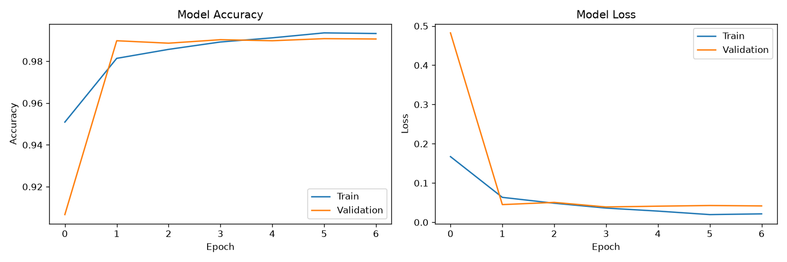
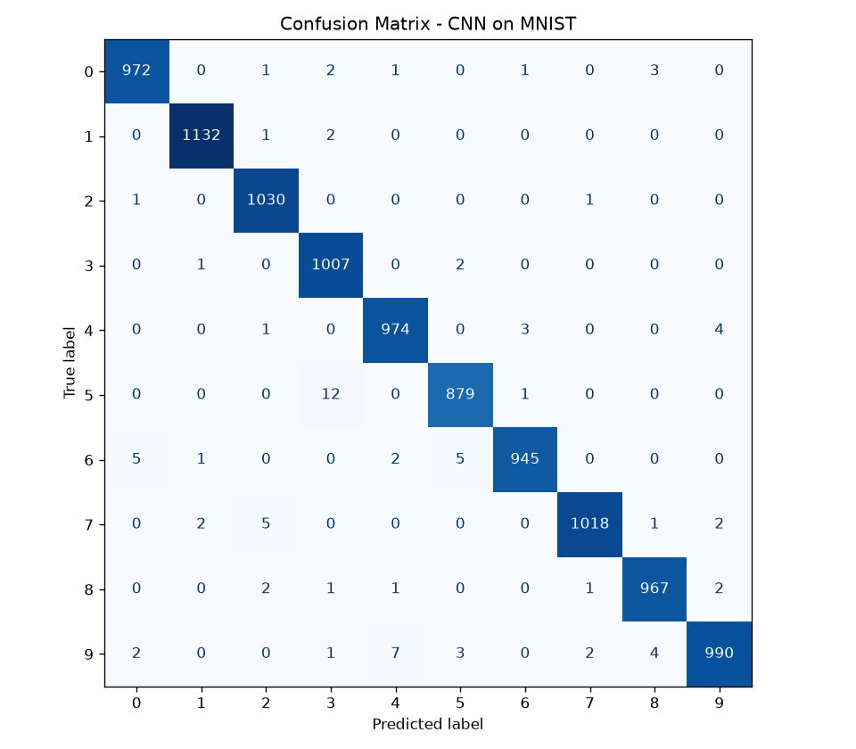
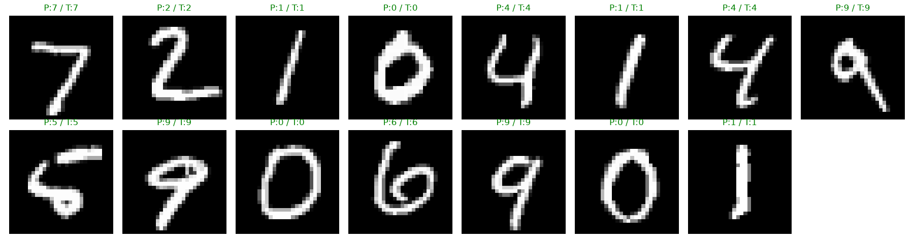

# Handwritten Character Recognition using CNN

### CodeAlpha Machine Learning Virtual Internship — Task 3

A deep learning project for recognizing handwritten digits using a **Convolutional Neural Network (CNN)** built with **TensorFlow/Keras** and trained on the **MNIST handwritten digit dataset**.

The trained CNN achieved a **99.14% test accuracy** on 10,000 unseen MNIST test images.

---

## 📌 Objective

The objective of this project is to develop a deep learning model capable of identifying handwritten digits from grayscale images.

The project uses a Convolutional Neural Network to automatically learn visual patterns such as edges, shapes, and digit structures before classifying each image into one of the ten digit classes (**0–9**).

---

## 🧠 Project Approach

The project follows an end-to-end image classification workflow:

1. Load the MNIST handwritten digit dataset
2. Normalize pixel values to the range `[0, 1]`
3. Reshape images for CNN input
4. Build a multi-layer Convolutional Neural Network
5. Train the model using the Adam optimizer
6. Evaluate performance on unseen test data
7. Generate classification metrics and visualizations
8. Save the trained model for future inference

---

## 🗂️ Dataset

The project uses the **MNIST handwritten digit dataset**, a standard benchmark dataset for image classification.

| Property        | Details         |
| --------------- | --------------- |
| Training Images | 60,000          |
| Test Images     | 10,000          |
| Image Size      | 28 × 28 pixels  |
| Image Type      | Grayscale       |
| Classes         | 10 (digits 0–9) |
| Input Shape     | 28 × 28 × 1     |

The dataset is automatically downloaded through `keras.datasets.mnist` when the training script is executed for the first time.

---

## 🏗️ CNN Architecture

The model consists of three convolutional stages followed by a classification head:

| Layer               | Configuration            |
| ------------------- | ------------------------ |
| Input               | 28 × 28 × 1              |
| Conv2D              | 32 filters, 3 × 3, ReLU  |
| Batch Normalization | —                        |
| MaxPooling          | 2 × 2                    |
| Conv2D              | 64 filters, 3 × 3, ReLU  |
| Batch Normalization | —                        |
| MaxPooling          | 2 × 2                    |
| Conv2D              | 128 filters, 3 × 3, ReLU |
| Batch Normalization | —                        |
| Flatten             | —                        |
| Dense               | 128 units, ReLU          |
| Dropout             | 0.4                      |
| Output              | 10 units, Softmax        |

### Model Configuration

* **Optimizer:** Adam
* **Loss Function:** Sparse Categorical Crossentropy
* **Batch Size:** 128
* **Maximum Epochs:** 15
* **Early Stopping:** Enabled
* **Random Seed:** 42
* **Total Parameters:** 897,802

Early stopping restored the best model weights, and training completed after **7 epochs**.

---

## 📊 Model Performance

The final CNN was evaluated on the complete MNIST test set containing 10,000 unseen images.

| Metric            |     Result |
| ----------------- | ---------: |
| **Test Accuracy** | **99.14%** |
| Test Loss         | **0.0286** |
| Test Samples      |     10,000 |
| Number of Classes |         10 |
| Training Epochs   |          7 |

### Classification Performance

The model achieved approximately **0.99 precision, recall, and F1-score** across the digit classes.

The strongest individual performance was observed for several classes, including digit **1**, which achieved approximately **1.00 precision, recall, and F1-score** on the test set.

---

## 📈 Results & Visualizations

The training script automatically generates the following visualizations:

### Training History

Shows the training and validation accuracy/loss across epochs.



### Confusion Matrix

Shows the classification performance across all ten digit classes.



### Sample Predictions

Displays sample test images along with the model's predictions and their true labels.



---

## 💾 Trained Model

The trained CNN is saved in Keras format:

```text
models/cnn_mnist_model.keras
```

The saved model can be loaded later for inference without retraining.

Example:

```python
from tensorflow import keras

model = keras.models.load_model("models/cnn_mnist_model.keras")
```

---

## ⚙️ How to Run Locally

### 1. Clone the Repository

```bash
git clone https://github.com/codebyahmadd/CodeAlpha_HandwrittenCharacterRecognition.git
cd CodeAlpha_HandwrittenCharacterRecognition
```

### 2. Create a Virtual Environment

Python **3.11** is recommended for this project.

```bash
python -m venv .venv
```

### 3. Activate the Environment

**Windows PowerShell:**

```powershell
.\.venv\Scripts\Activate.ps1
```

If PowerShell blocks script execution for the current session:

```powershell
Set-ExecutionPolicy -Scope Process -ExecutionPolicy Bypass
```

Then activate the environment again:

```powershell
.\.venv\Scripts\Activate.ps1
```

### 4. Install Dependencies

```bash
python -m pip install -r requirements.txt
```

### 5. Train the CNN

```bash
python src/train_cnn.py
```

The first run requires an internet connection so TensorFlow/Keras can download the MNIST dataset.

After training, the model and evaluation visualizations will be generated automatically.

---

## 🧪 Offline Demo

The repository also contains an optional lightweight offline demonstration:

```bash
python src/offline_demo.py
```

The offline demo uses **scikit-learn's built-in handwritten digits dataset**, which contains 1,797 images of size 8 × 8 pixels.

It trains an **MLP (Multi-Layer Perceptron)** classifier and demonstrates a complete data-processing, training, evaluation, and visualization workflow without requiring TensorFlow or an external dataset download.

> **Note:** The offline demo is supplementary and is **not the main CodeAlpha Task 3 model**. The primary submission is the CNN trained on the MNIST dataset.

---

## 📁 Project Structure

```text
CodeAlpha_HandwrittenCharacterRecognition/
│
├── data/
│   └── README.md
│
├── models/
│   └── cnn_mnist_model.keras
│
├── notebooks/
│   └── Handwritten_Character_Recognition_CNN.ipynb
│
├── outputs/
│   ├── confusion_matrix.png
│   ├── sample_predictions.png
│   ├── training_history.png
│   ├── offline_demo_confusion_matrix.png
│   └── offline_demo_sample_predictions.png
│
├── src/
│   ├── offline_demo.py
│   └── train_cnn.py
│
├── .gitignore
├── README.md
└── requirements.txt
```

---

## 🛠️ Tech Stack

* **Python 3.11**
* **TensorFlow 2.21**
* **Keras 3.15**
* **NumPy**
* **scikit-learn**
* **Matplotlib**
* **Seaborn**

---

## 🚀 Future Improvements

The current project focuses on handwritten digit recognition. It can be extended in several ways:

* Replace MNIST with **EMNIST** for broader handwritten character recognition
* Build a **Streamlit** web application for interactive predictions
* Allow users to draw digits directly on a web interface
* Add real-time image preprocessing and prediction
* Experiment with deeper CNN architectures and data augmentation
* Extend the system toward handwritten character and word recognition

---

## 🎓 About the Project

This project was developed as part of the **CodeAlpha Machine Learning Virtual Internship — Task 3**.

It demonstrates the practical application of:

* Deep Learning
* Convolutional Neural Networks
* Computer Vision
* Image Classification
* Model Evaluation
* TensorFlow/Keras

The final CNN achieved **99.14% accuracy** on the MNIST test dataset.

---

## 👤 Author

**Ahmad Yar Daha**

[LinkedIn](https://www.linkedin.com/in/ahmad-yar-daha-6753bb423/) · [GitHub](https://github.com/codebyahmadd)

---

⭐ If you find this project useful, feel free to explore the repository and its implementation.
